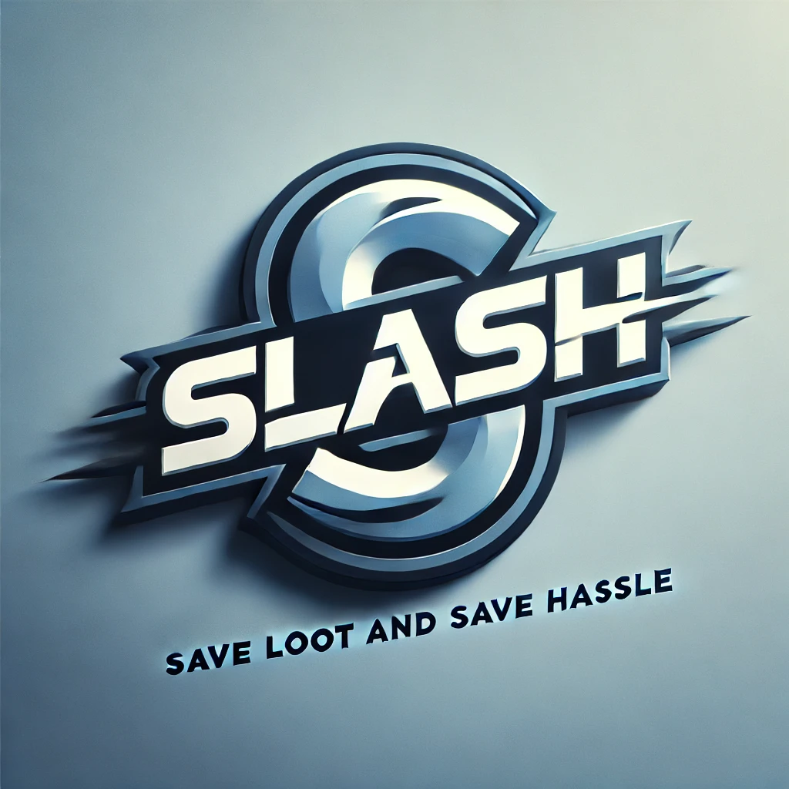

<p align="center"></p>

[](https://doi.org/10.5281/zenodo.14027393)

[](https://github.com/DFY-NCSU/slash-phase6)
[](https://github.com/DFY-NCSU/slash-phase6/actions/workflows/flake8.yml)
[](https://github.com/DFY-NCSU/slash-phase6/actions/workflows/syntax.yml)
[](https://github.com/DFY-NCSU/slash-phase6/actions/workflows/style.yml)
[](https://github.com/DFY-NCSU/slash-phase6/actions/workflows/python-app.yml)
[](https://codecov.io/gh/DFY-NCSU/slash-phase6/tree/main)


<!-- <p align="center"></p> -->
<!-- 
[](https://doi.org/10.5281/zenodo.14027393)

[](https://codecov.io/gh/SE23-Team44/slash-phase4)
[](https://github.com/DFY-NCSU/slash-phase6)
[](https://github.com/MeryHarikaG/slash-phase5/actions/workflows/style_checker.yml)
[](https://github.com/MeryHarikaG/slash-phase5/actions/workflows/unit_test.yml)
[](https://github.com/MeryHarikaG/slash-phase5/actions/workflows/python-app.yml)
[](https://github.com/DFY-NCSU/slash-phase6/actions/workflows/main.yml)
[](https://github.com/MeryHarikaG/slash-phase5/actions/workflows/code_cov.yml)
[](https://github.com/DFY-NCSU/slash-phase6/actions/workflows/close_as_a_feature.yml) -->


<!--Badges-->
<a href="https://github.com/DFY-NCSU/slash-phase6/blob/main/LICENSE"></a>
<a href="https://github.com/DFY-NCSU/slash-phase6/forks"></a>
<a href="https://github.com/DFY-NCSU/slash-phase6/stargazers"></a>
<a href="https://github.com/DFY-NCSU/slash-phase6/issues"></a>
<a href="https://github.com/DFY-NCSU/slash-phase6/issues?q=is%3Aissue+is%3Aclosed">
<a href="https://github.com/DFY-NCSU/slash-phase6/pulls">
<a href="https://github.com/DFY-NCSU/slash-phase6/pulls?q=is%3Apr+is%3Aclosed">
<a href="https://github.com/DFY-NCSU/slash-phase6/discussions">


<p align="center">
    <a href="https://github.com/DFY-NCSU/slash-phase6/issues/new?assignees=&labels=&projects=&template=bug_report.md&title=">Report Bug</a>
    ·
    <a href="https://github.com/DFY-NCSU/slash-phase6/issues/new?assignees=&labels=&projects=&template=feature_request.md&title=">Request Feature</a>
</p>

<!-- ```diff
! All the latest changes in slash-phase5 are in "main" branch.
! Score cards (Rubric) are in "Project 3" folder.
``` -->


Do you love shopping? Are you in search of some good deals while shopping online?! Slash is here to help you look for the best deals!


<!-- Slash is a publicly accessible web API framework that allows one to scrape the most popular e-commerce websites to get the best deals on the searched items across multiple e-commerce websites. Currently supported websites include [Walmart](https://www.walmart.com/), [Target](https://www.target.com/), [BestBuy](https://www.bestbuy.com/), [Costco](https://www.costco.com), and [EBay](https://www.ebay.com/). -->
Tired of searching multiple websites for the best deals? Slash is 
here to make your online shopping experience smarter and faster! 
Slash is a web API framework that automatically scrapes top 
e-commerce sites—[Walmart](https://www.walmart.com/), [Target](https://www.target.com/), [BestBuy](https://www.bestbuy.com/), [Costco](https://www.costco.com), and [EBay](https://www.ebay.com/)—to 
find and compare the best deals, saving you time and money. Whether 
you're a student on a budget or a data analyst building real-time 
datasets, Slash is the tool for you.
- **Fast**: Compare deals across platforms in seconds.
- **Easy**: User-friendly APIs to filter, sort, and customize search results.
- **Powerful**: Delivers tailored results in JSON format, perfect for seamless integration.

---

<p align="center">
  <a href="#movie_camera-checkout-our-video">Checkout our video</a>
  ::
  <a href="#rocket-installation">Installation</a>
  ::
  <a href="#computer-technology-used">Technology Used</a>
  ::
  <a href="#bulb-use-case">Use Case</a>
  ::
  <a href="#page_facing_up-why">Why</a>
  ::
  <a href="#golf-future-roadmap">Future Roadmap</a>
  ::
  <a href="#sparkles-contributors">Contributors</a>
  ::
  <a href="#Acknowledgement">Acknowledgement</a>
  ::
  <a href="#email-support">Support</a>
  
</p>

---

:movie_camera: Checkout our video
---

[bilibili](https://www.bilibili.com/video/BV1sZDJYYEuX)


---

:rocket: Installation
---
1. Clone the Github repository to a desired location on your computer. You will need [git](https://git-scm.com/) to be preinstalled on your machine. Once the repository is cloned, you will then ```cd``` into the local repository.
```
git clone https://github.com/DFY-NCSU/slash-phase6.git
cd slash-phase6
```
1. This project uses Python 3, so make sure that [Python](https://www.python.org/downloads/) and [Pip](https://pip.pypa.io/en/stable/installation/) are preinstalled. All requirements of the project are listed in the ```requirements.txt``` file. Use pip to install all of those.
```
pip3 install -r requirements.txt
```
1. To run this project, you must install PostgreSQL on your system. If you haven't already installed it, you can download the latest version of PostgreSQL from the official website: [PostgreSQL Downloads](https://www.postgresql.org/download/).

### Configuring Database Connection

Once you've installed PostgreSQL, follow these steps to set up the database connection in your project:

i. Open the database.py file in your project directory.

ii. Locate the top section of the code where you define the database connection settings. It might look something like this:

   ```
   username = 'postgres'
   password = 'pass'
   ```
Replace username and password value from 'postgres', 'pass' with your PostgreSQL username password, respectively.

4. Once all the requirements are installed, you will have to enter the `src` folder. Once in the `src` folder, use the python command to run the `main.py` file.
```
cd src

For Mac
python3 main.py

For Windows
python main.py
```
5. While the above is running, go to new terminal and run streamlit application. Firstly go back to the root directory and run the following command:
```
cd ..

For Mac
python3 -m streamlit run slash_user_interface.py

For Windows
streamlit run slash_user_interface.py
```

:computer: Technology Used
---
- [Streamlit](https://streamlit.io/)
- [Fast API](https://fastapi.tiangolo.com)
- [Postgre SQL](https://www.postgresql.org)
- [Python](https://www.python.org)

:bulb: Use Case
---
* ***Students***: Students coming to university are generally on a budget and time constraint and generally spend hours wasting time to search for products on Websites. Slash is the perfect tool for these students that slashes all the unnecessary details on a website and helps them get prices for a product across multiple websites.Make the most of this tool in the upcoming Black Friday Sale.
* ***Data Analysts***: Finding data for any project is one of the most tedious job for a data analyst, and the datasets found might not be the most recent one. Using slash, they can create their own dataset in real time and format it as per their needs so that they can focus on what is actually important.

:page_facing_up: Why
---
- In a market where we are spoilt for choices, we often look for the best deals.  
- The ubiquity of internet access has leveled the retail playing field, making it easy for individuals and businesses to sell products without geographic limitation. In 2020, U.S. e-commerce sales, receiving a boost due to the COVID-19 pandemic, grew 44% and represented more than 21% of total retail sales, according to e-commerce information source Internet Retailer.
- The growth of e-commerce has not only changed the way customers shop, but also their expectations of how brands approach customer service, personalize communications, and provide customers choices.
- E-commerce market has prompted cut throat competition amongst dealers, which is discernable through the price patterns for products of major market players. Price cuts are somewhat of a norm now and getting the best deal for your money can sometimes be a hassle (even while online shopping).
- This is what Slash aims to reduce by giving you an easy to use, all in one place solution for finding the best deals for your products that major market dealers have to offer!
- Slash in its current form is for students who wish to get the best deals out of every e-commerce site and can be used by anyone who is willing to develop an application that consumes these web APIs.
- Future scope includes anything from a web application with a frontend or any Android or IOS application that utilises these Web APIs at their backend. Anyone can build their own custom application on top of these web APIs.

:golf: Phase 6 developments
---
1. **Expanded Platform Coverage with Costco Integration**
   - **Description**: The project now supports Costco, in addition to previously integrated platforms like Walmart and Target, offering users a broader selection of products and prices.
   - **Functionality**: Users can access pricing and product information from Costco alongside other platforms, ensuring a more comprehensive shopping experience.

2. **Improved Filtering and Sorting Capabilities**
   - **Description**: Logical bugs in the sorting function have been corrected, and new filtering options allow users to easily narrow down searches by price.
   - **Functionality**: Users can refine searches with advanced sorting and filtering features, enabling more precise price-based sorting and facilitating better deal discovery.

3. **Reliable and Refined Scraper Performance**
   - **Description**: Bug fixes have been implemented to address previous issues with scrapers, ensuring consistent and accurate retrieval of price information.
   - **Functionality**: Scrapers now reliably gather up-to-date pricing from multiple e-commerce sites, providing users with accurate and timely data.

4. **Advanced Price Sorting and Enhanced User Interface**
   - **Description**: The frontend has been redesigned to improve user experience with intuitive navigation, highlighted deals, and a clear wishlist display.
   - **Functionality**: Users enjoy a visually appealing interface with improved navigation, deal highlights, and an organized wishlist, making the application smoother and more enjoyable to use.


5. ## Price Distribution Plot

   This feature allows users to visualize the distribution of product prices. By analyzing a list of product prices, the tool generates a **histogram** and a **Kernel Density Estimation (KDE)** curve to showcase the frequency and spread of prices.

   ### Key Features ✨:
   - **Price Distribution Visualization**: Displays a **histogram** with an overlaid **KDE** curve to understand how prices are distributed.
   - **Statistical Indicators**: Highlights key statistics such as:
  - **Mean Price**: The average price 💵.
  - **Median Price**: The middle value of the price data 📍.
  - **Min/Max Prices**: The lowest and highest prices 🔥💰.
  - **Standard Deviation**: A measure of price variability 📉.
   - **Interactive Plot**: The plot is rendered interactively, allowing users to easily analyze price trends.
   - **Customizable Aesthetics**: The visualization includes options to customize **labels**, **grid lines**, and **colors** for improved clarity and presentation.

   This feature is ideal for:
   - **Market Analysis**: Compare prices across different sources or vendors.
   - **Pricing Strategy**: Help sellers set competitive prices.
   - **Consumer Insights**: Enable consumers to visualize and assess price ranges across various platforms.

   Gain insights into pricing trends and make data-driven decisions with this powerful visualization tool!


:golf: Future Roadmap
---
- Advanced Search Capabilities: We will enhance the current search functionality by adding more advanced filters such as product ratings, seller ratings, availability, and shipping time, giving users more refined control over search results, improving user satisfaction.
- Predictive Price Model: We plan to implement a machine learning-based predictive model that advises users on the optimal time to make purchases, based on historical price trends and forecasting.
- Pagination for Search Results: A pagination                  system to improve the display of search results,          particularly for large datasets is in progress.
- Social Media Login and Sharing: We plan to allow users to log in using social media accounts (e.g., Google, Facebook) and share their wishlists or best deals directly with friends via social platforms.
- Price Chart Visualization: We are going to introduce dynamic visualizations of price trends for products, allowing users to track price changes over time in a graphical format.

:sparkles: Contributors && Contribution
---

1. Sen Fang (sfang9@ncsu.edu)
   - API refactoring for Walmart, Ebay, Target.
   - New shopping platform supporting - Costco.
   - Test wrting for Walmart, Ebay, and Costco.
   - Demo video building.
   - Form infilling.
   - Regression testing.
   - Real-world testing.
   - Support workflow (minor).
2. Weiyuan Ding (wding8@ncsu.edu)
   - API refactoring for BestBuy.
   - Test writing for BestBuy.
   - Support cross-platforms testing.
   - Feature testing.
   - Support workflow (major).
   - Code clean for format.
   - Poster building.
   - Form infilling.
   - Regression testing.
   - Real-world testing.
3. Xiaoran Yang (xyang49@ncsu.edu)
   - Test writing for Target.
   - Documentation wrting.
   - 2-mins video building.


## 🙏 Acknowledgements <a name="Acknowledgement"></a>
<!-- We would like to thank Professor Dr Timothy Menzies for helping us understand the process of Maintaining a good Software Engineering project. We would also like to thank the teaching assistants for their support throughout the project. -->
We would like to thank the teaching assistants for their support throughout the project.
Some code in our project is modified from this [repo](https://github.com/MeryHarikaG/slash-phase5).

:email: Support
---
For any queries and help, please reach out to us at: thefatblue@gmail.com
