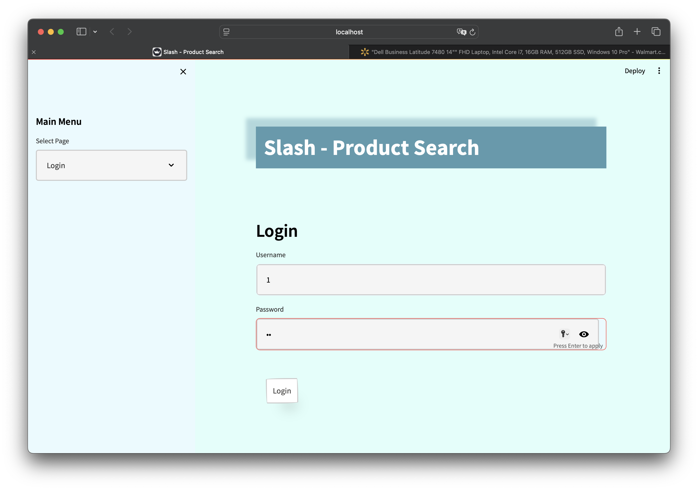
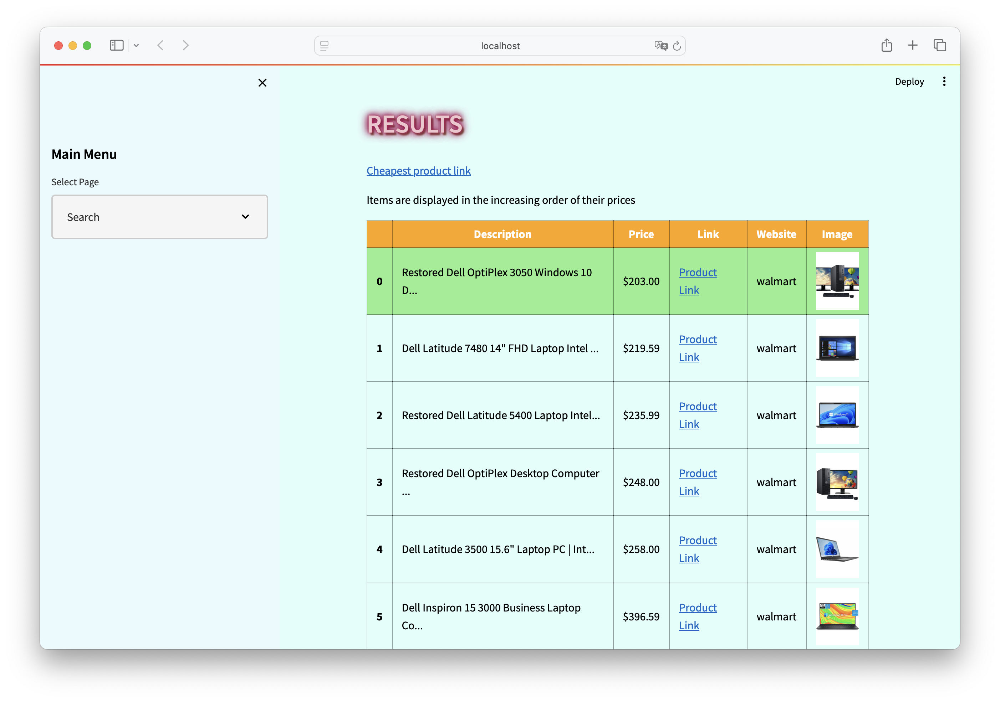
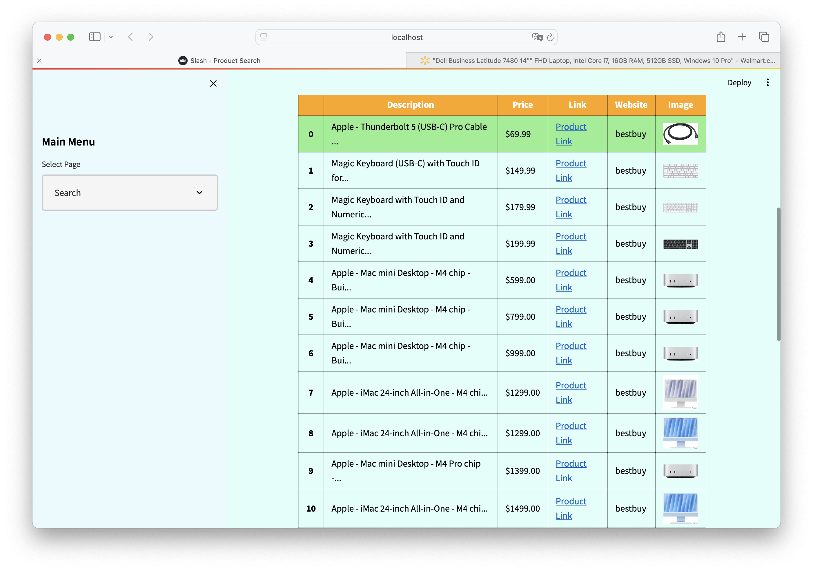

# Slash-Phase6

### Motivation

In today’s e-commerce landscape, consumers face an overwhelming number of choices and often spend considerable time comparing prices across different websites to find the best deals. This process can be time-consuming and tedious. To address this issue, Slash was developed as a unified platform to help users quickly access the best prices from several popular e-commerce sites, saving both time and effort.

### Introduction

Slash is a web application that scrapes product information from popular e-commerce websites such as Walmart, Target, BestBuy, and eBay. Users can search for specific products on Slash, and the system will return price information from each site, allowing users to compare and find the most favorable deals. This project was developed by a team of students at North Carolina State University (NCSU) with the aim of providing consumers an efficient and convenient shopping assistant tool.

### Checkout our video
[Slash Presentation](https://www.bilibili.com/video/BV1gXDWYpEUQ/?spm_id_from=333.999.0.0)

### Steps for Execution

1. **Clone the Repository**:
   
    Use the following command to clone the project repository locally:
    
    ```bash
    git clone <https://github.com/DFY-NCSU/slash-phase6.git>
    ```
    
2. **Install Dependencies**:
   
    Enter the project directory and install the required Python dependencies:
    
    ```bash
    cd slash-phase6
    pip install -r requirements.txt
    
    ```
    
3. **Configure Database**:
   
    Ensure that PostgreSQL is installed. In the `src/database.py` file, update the database connection settings with your PostgreSQL username and password.
    
    Start the SQL with this command
    
    - For Windows
    
    ```bash
    pg_ctl -D your_path start
    ```
    
    - For Mac
    
    ```bash
    brew services start postgresql
    ```
    
    - For Linux
    
    ```bash
    sudo systemctl start postgresql
    ```
    
4. **Run the Backend Service**:
   
    Navigate to the `src` directory and start the backend service:
    
    ```bash
    cd src
    python main.py
    ```
    
5. **Launch the Frontend Interface**:
   
    In a new terminal window, return to the root project directory and run the Streamlit application:
    
    ```bash
    cd ..
    streamlit run slash_user_interface.py
    
    ```
    
6. **Access the Application**:
   
    Open your browser and navigate to `http://localhost:8501` to access the user interface of the Slash application.
    

Following these steps, you will successfully run the Slash application and experience its powerful price comparison features.

## Output

### Register


### Login



### Search Function


### Search Results by walmart



### Search Results by bestbuy



### Search Results by ebay


## Third Party Dependencies

- `altair==4.2.2`
- `anyio==3.3.4`
- `asgiref==3.6.0`
- `astor==0.8.1`
- `attrs==23.1.0`
- `base58==2.1.1`
- `bcrypt==3.2.0`
- `beautifulsoup4==4.10.0`
- `blinker==1.6.2`
- `cachetools==5.3.1`
- `certifi==2021.10.8`
- `cffi==1.16.0`
- `charset-normalizer==2.0.7`
- `click==7.1.2`
- `CurrencyConverter==0.17.11`
- `ebaysdk==2.2.0`
- `ecdsa==0.18.0`
- `entrypoints==0.4`
- `fake_useragent==1.5.1`
- `fastapi==0.70.0`
- `gitdb==4.0.10`
- `GitPython==3.1.36`
- `greenlet==3.0.0`
- `h11==0.14.0`
- `idna==3.3`
- `importlib-metadata==6.8.0`
- `Jinja2==3.1.2`
- `jsonschema==4.19.0`
- `jsonschema-specifications==2023.7.1`
- `lxml==4.9.3`
- `markdown-it-py==3.0.0`
- `MarkupSafe==2.1.3`
- `mdurl==0.1.2`
- `nest-asyncio==1.5.1`
- `numpy==1.26.0`
- `packaging==23.1`
- `pandas==2.1.0`
- `passlib==1.7.4`
- `Pillow==10.0.1`
- `protobuf==3.20.1`
- `psycopg2-binary==2.9.3`
- `pyarrow==13.0.0`
- `pyasn1==0.5.0`
- `pycparser==2.21`
- `pydantic==1.8.2`
- `pydeck==0.8.1b0`
- `Pygments==2.16.1`
- `PyMySQL==1.0.2`
- `pyshorteners==1.0.1`
- `pytest==8.3.3`
- `python-dateutil==2.8.2`
- `python-jose==3.3.0`
- `python-multipart==0.0.5`
- `pytz==2023.3.post1`
- `referencing==0.30.2`
- `requests==2.31.0`
- `rich==13.6.0`
- `rpds-py==0.10.3`
- `rsa==4.9`
- `selenium==4.25.0`
- `six==1.16.0`
- `smmap==5.0.0`
- `sniffio==1.2.0`
- `soupsieve==2.2.1`
- `SQLAlchemy==1.4.32`
- `starlette==0.16.0`
- `streamlit==1.27.2`
- `tabulate==0.8.9`
- `tenacity==8.2.3`
- `toml==0.10.2`
- `toolz==0.12.0`
- `tornado==6.3.3`
- `typing_extensions==4.12.2`
- `tzdata==2023.3`
- `tzlocal==5.0.1`
- `urllib3==1.26.7`
- `uvicorn==0.15.0`
- `validators==0.22.0`
- `watchdog==3.0.0`
- `zipp==3.17.0`
